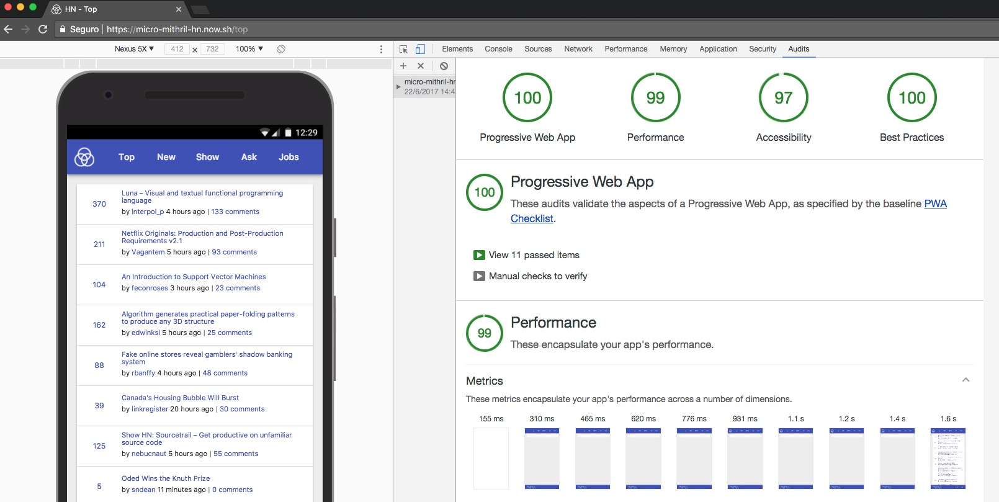

# PWA - Micro Mithril Hacker News Clone

HackerNews clone built with [Micro](https://www.npmjs.com/package/micro), [Mithril v1.1.1](https://mithril.js.org/) and [Pure Material](https://masquerade-circus.github.io/pure-material-css/#about).

This is a minimal and direct development. No fancy stuff. There is much that could be improved on it.

[Mithril](https://mithril.js.org/) is a small but powerful framework and can be used for large projects, however, [Pure Material](https://masquerade-circus.github.io/pure-material-css/#about) is still in alpha state and I don't recommend it for its use in production.

<br/>

<p align="center">
  <a href="https://micro-mithril-hn.now.sh" target="_blank">
    
    <br>
    Live Demo
  </a>
</p>

## Checklist

### PWA

- [X] Site is served over HTTPS with [now](https://now.sh/)
- [X] Pages are responsive on tablets & mobile devices with [Pure Material](https://masquerade-circus.github.io/pure-material-css/#about)
- [X] Metadata provided for PWA like theme-color
- [X] Content for scriptless environment
- [X] Add to Home screen with Web Manifest
- [X] Build icons on the fly with [Favicons](https://www.npmjs.com/package/favicons)

### HNPWA

- [X] Views: Hacker News Top Stories, New, Show, Ask, Jobs & threaded Comments
- [X] App must display 30 items per-page for story list views
- [X] App must be a Progressive Web App
- [X] App must score over a 90/100 using Lighthouse
- [X] App must become aim to be interactive in under 5 seconds on a Moto G4 over 3G
- [X] App must use the Application Shell pattern
- [X] App must do its best to work cross-browser
- [X] App supports offline caching of HN data
- [X] App may use server-side rendering.
- [X] Using Hackernews official firebase API with [firebase-hackernews](https://www.npmjs.com/package/firebase-hackernews)

## HNPWA Details

- Framework/UI libraries: [Micro](https://www.npmjs.com/package/micro) + [Mithril](https://mithril.js.org/) + [Pure Material](https://masquerade-circus.github.io/pure-material-css/#about)
- Module bundling: [Webpack](https://webpack.github.io/)
- Service Worker: Application Shell
- Server-side rendering: No
- API: [Hacker News Firebase API](https://www.npmjs.com/package/firebase-hackernews)
- Hosting: [Now](https://now.sh/)
- Other details: Task runner [Gulp](http://gulpjs.com/). CSS Preprocessor [Stylus](http://stylus-lang.com/).

## Getting Started

``` bash
# install dependencies
yarn install

# serve at localhost:8000 with browserSync
yarn dev

# build for production with minification
yarn build
```

## Legal

Author: [Masquerade Circus](http://masquerade-circus.net). License [Apache-2.0](https://opensource.org/licenses/Apache-2.0)
